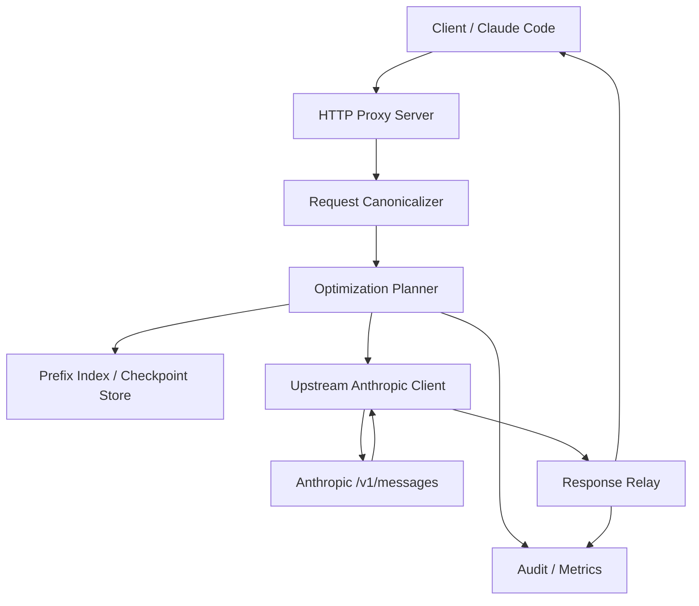
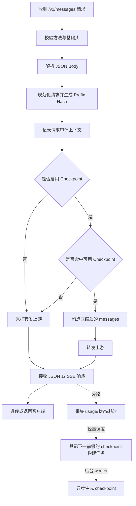

# Anthropic `POST /v1/messages` 透明代理设计文档

- 版本：v0.4 草稿
- 日期：2026-04-27
- 作者：同尘
- 状态：归档设计稿

## 1. 概述

本文定义一个基于 Go 实现的 Anthropic `POST /v1/messages` 透明代理。它面向 Claude Code、OpenCode、以及同类 Anthropic 编码代理客户端，目标是在**不修改客户端调用协议**的前提下，为请求链路增加以下能力：

- 审计：请求量、token、耗时、命中率、错误率、压缩收益
- 优化：在客户端已具备 Anthropic 原生 prompt caching 的基线之上，主动做 checkpoint 压缩
- 透明转发：尽量保持请求/响应协议与上游一致，尤其是 streaming SSE
- 本地状态：缓存、会话前缀索引、审计记录默认只落本地

本文档只覆盖 **Anthropic `POST /v1/messages`**，不覆盖 OpenAI、Anthropic 其他端点，也不试图在第一阶段统一多供应商抽象。  
本文默认目标客户端已经具备并使用 Anthropic 原生 prompt caching 能力，代理**不负责补齐或规划 `cache_control`**，只在这一前提下做进一步压缩与观测。

## 2. 设计结论

### 2.1 推荐路线

本文实际实现目标为**方案 B：透明代理 + 原生 caching 观测 + 主动 checkpoint 压缩**。三阶段递进只是落地顺序：

1. **MVP：透明代理 + 审计 + 原生 caching 观测**
2. **Phase 2：基于前缀内容寻址的 checkpoint 压缩**
3. **Phase 3：可选本地压缩器 / 同供应商低成本压缩器 / 第三方压缩器**

方案 A 只作为 MVP 的临时子集，不是最终目标；方案 C 不进入当前实现范围。

推荐语言为 **Go**，原因如下：

- 该服务的核心问题是 HTTP 反向代理、SSE 透传、JSON 变换、哈希缓存、指标采集，而不是复杂业务逻辑
- Go 在高并发 I/O、低运维复杂度、单二进制部署、稳定内存模型上更适合这个场景
- 相比 Rust，Go 的工程推进速度更快，适合作为 v0/v1 基础设施落地
- 相比 Node.js/Python，Go 在长连接、代理、中间件、资源占用和可预测性上更稳

### 2.2 关键修正

基于上一轮评审，原始方案需要做如下修正：

- 不再假设存在稳定的 `session_id`
- 不将压缩摘要注入为 `user` 消息
- 不默认把对话发送给第三方压缩模型
- 不把“首次压缩同步发生在主请求上”作为常态路径
- 不把 OpenAI 与 Anthropic 统一成一套相同的压缩实现

## 3. 范围与非目标

### 3.1 范围

本设计在 v0.4 中包含：

- 代理 Anthropic `POST /v1/messages`
- 支持非流式与 `stream=true` 的 SSE 流式请求
- 透传常规 headers，包括 `x-api-key`、`anthropic-version`、`anthropic-beta`
- 解析与保留 `system`、`tools`、`messages`、`thinking`、`tool_choice` 等字段
- 本地审计与指标采集
- 本地内容前缀索引与 checkpoint 缓存
- 观测请求中已有的原生 prompt caching 使用效果
- 以 checkpoint 压缩为唯一主动优化层，默认关闭或灰度开启

### 3.2 非目标

以下内容不属于本阶段目标：

- OpenAI API 代理
- 通用多供应商统一 schema
- 修改客户端 SDK 或 CLI 行为
- 对所有消息类型做激进的有损裁剪
- 把所有历史用户消息无条件压缩为摘要
- 以第三方云模型作为默认压缩器

## 4. 外部事实与设计前提

截至 **2026-04-23**，基于 Anthropic 官方文档，本文依赖以下事实：

1. `POST /v1/messages` 是**无状态**接口，多轮对话需要客户端在每次请求中携带完整历史。
2. `stream=true` 时，Anthropic 使用 **SSE** 返回流式事件，事件类型可能扩展，代理需要对未知事件保持兼容。
3. Anthropic 支持 **prompt caching**，缓存前缀层级是 `tools -> system -> messages`。
4. prompt caching 对前缀要求**精确匹配**，命中依赖输入前缀的稳定性与规范化。
5. Claude Code / Claude Code SDK 官方文档明确强调其具有自动 prompt caching 与性能优化能力。
6. Claude Code 在上下文接近上限时会触发 **auto-compact**；代理的优化应尽量发生在此之前。

这些事实意味着：

- 会话识别不应依赖客户端显式 session 字段
- 对本文目标客户端，原生 caching 应被视为**既有基线**，不是代理的核心增值点
- 流式链路必须以透传为先，不能为了压缩而破坏 SSE 语义

## 5. 设计目标

### 5.1 目标

- 对客户端透明：客户端仍然调用 Anthropic Messages API 语义
- 降低成本：在已有原生 caching 的基础上，进一步减少发往昂贵模型的历史上下文 token
- 降低风险：checkpoint 压缩默认保守、可灰度、可回退
- 保持体验：尽量不在主请求路径引入明显额外延迟
- 本地可观测：本地查看成本、节省量、命中率、失败原因
- 可灰度：任何优化失败时都能退化到纯透传

### 5.2 成功标准

- 对 Claude Code 等客户端无需代码改造即可接入
- 代理后的响应协议与上游保持兼容
- 在长对话开发场景中，输入 token 明显下降
- 流式请求可稳定透传，未知 SSE 事件不丢失
- 优化链路异常时，不影响基础转发可用性

## 6. 架构方案对比

### 方案 A：纯透明代理 + 审计

优点：

- 最稳
- 最容易上线
- 不改变提示词语义

缺点：

- 无法主动优化 token 成本
- 收益主要来自统计而非节省

### 方案 B：透明代理 + 原生 caching 观测 + 主动 checkpoint 压缩

优点：

- 聚焦代理真正提供的新增价值
- 不与客户端已有的原生 caching 职责重叠
- 能直接面向长会话历史膨胀问题

缺点：

- 仍然存在语义丢失风险
- 需要本地状态、评估集和更复杂的回退策略

### 方案 C：代理接管 prompt caching 规划 + 主动压缩

优点：

- 对通用 Anthropic 客户端适用面更广
- 代理可以统一控制 cache breakpoint 策略

缺点：

- 与当前目标客户端的既有能力重叠
- 产品边界变宽，容易分散实现重点

### 推荐

推荐且实际要实现的路线是 **B**。
也就是说，v1 把“客户端已有原生 caching”作为已成立前提，代理专注于做它之上的主动 checkpoint 压缩、观测和回退。

方案 A 仅用于解释最小可上线形态；方案 C 暂不实现，除非后续目标扩展到不具备原生 caching 能力的通用 Anthropic 客户端。

## 7. 总体架构



组件职责：

- `HTTP Proxy Server`：接收客户端请求，管理超时、header、body、streaming
- `Request Canonicalizer`：规范化请求，提取稳定前缀，生成哈希
- `Optimization Planner`：决定是 passthrough、observe-only、还是 checkpoint 压缩
- `Prefix Index / Checkpoint Store`：维护本地前缀链、checkpoint、审计辅助索引
- `Audit / Metrics`：记录请求、响应、usage、延迟、命中、节省量
- `Upstream Anthropic Client`：与 Anthropic 上游交互
- `Response Relay`：透传 JSON 或 SSE，并在响应末尾采集 usage

## 8. 请求处理策略

### 8.1 基线与主动优化层

本文只定义两层：

1. **Baseline：客户端原生 prompt caching 基线**
2. **L1：代理主动 checkpoint 压缩**

Baseline 不是代理负责实现的能力，而是代理运行时的既有前提。  
L1 是代理的唯一主动优化层。

### 8.2 Baseline：客户端原生 prompt caching

对 Claude Code、Claude Code SDK 及同类目标客户端，本文假设：

- 请求已经带有适合上游原生 prompt caching 的结构
- 客户端自身或其 SDK 已经在做 caching 相关优化
- 代理不负责注入、补齐或规划 `cache_control`

代理在这个层面只做两件事：

- 透传与兼容
- 从响应 `usage` 中观测 `cache_read_input_tokens` 与 `cache_creation_input_tokens`

### 8.3 L1：checkpoint 压缩

只有在满足以下条件时才考虑 L1：

- 输入 token 估算超过软阈值
- 或总轮次超过阈值
- 且历史消息表现为 append-only 前缀增长
- 且没有命中可复用的现成 checkpoint

L1 的目标不是把所有历史变成一句摘要，而是生成一个**结构化 checkpoint**，替换较旧的历史上下文。

## 9. 会话建模：不用 `session_id`，改用内容前缀寻址

原始方案把“会话识别”当成首要难题，但对 Anthropic Messages API 来说，更稳的办法不是猜会话，而是做**内容前缀寻址**。

### 9.1 原则

- 每次请求本身携带完整历史
- 代理对请求做规范化后，为每个历史前缀计算 hash
- 当某个请求是上一个请求的追加前缀时，可以直接复用上次状态

### 9.2 前缀链模型

```text
R10 = [m1..m10]
R11 = [m1..m10, m11]
R12 = [m1..m10, m11, m12]
```

如果 `hash([m1..m10])` 已存在，则 `R11` 和 `R12` 不需要重新猜测“是否同一会话”，只需要判断前缀是否延续。

### 9.3 好处

- 避免启发式会话识别误伤
- 可天然支持多个并发会话
- 更适合做增量 checkpoint

## 10. Checkpoint 语义设计

### 10.1 拒绝的做法

不采用把历史摘要塞进一条 `user` 消息的方案。原因：

- 会改变消息层级语义
- 容易让模型把“历史事实”误当成“用户当前新指令”
- 对工具调用、约束保持和任务边界不稳定

### 10.2 推荐做法

采用**合成 assistant checkpoint**：

- 保留原始 `system`
- 保留最近 `N` 轮完整对话，`N` 必须支持配置
- 用一条合成的 `assistant` 文本消息承载旧历史 checkpoint

这里的“轮”指一组相邻的用户输入及其后续 assistant/tool 结果。checkpoint 只能覆盖较旧的历史，不能压缩结尾 `N` 轮对话，以确保最新任务、刚发生的工具结果、错误上下文和用户最新约束仍以原始消息形式进入模型。

该 checkpoint 不是自由散文，而是固定结构：

```markdown
# Conversation Checkpoint

## Stable constraints
- 用户长期要求
- 禁止项与边界条件

## Project state
- 关键文件与模块
- 已完成修改

## Open work
- 当前未解决问题
- 下一步待办

## Tool and error history
- 仍然相关的工具结果
- 仍然相关的错误结论
```

### 10.3 为什么用 assistant checkpoint

- 语义上更接近“对已有对话状态的回顾”
- 不会把摘要提升成比用户更高优先级的指令
- 比注入到 `system` 更少污染全局行为

## 11. Checkpoint 触发与生成

### 11.1 触发条件

默认满足以下任一条件时进入候选态：

- `estimated_input_tokens >= 32_000`
- `message_count >= 10`

只有在以下附加条件成立时才真正调度后台压缩任务：

- 历史前缀没有可复用 checkpoint
- 当前请求不是高优先级低延迟模式
- 当前内容类型在支持集合内
- 除去配置要求保留的最近 `N` 轮后，仍有足够长的旧历史值得压缩
- 当前会话前缀没有正在执行的压缩任务

压缩覆盖范围按配置的 `KeepRecentTurns` 计算：若 `KeepRecentTurns=N`，则候选 checkpoint 只能覆盖 `messages[0:coverage_end]`，其中 `coverage_end` 位于最近 `N` 轮之前。低于该边界的最新对话不进入压缩器。

### 11.2 首批支持范围

L1 在第一版只支持：

- 纯文本或以文本为主的历史消息
- 常见代码代理会话
- 不包含复杂多媒体历史压缩

以下情况默认不做 L1：

- 大量图片/文档块
- 风险较高的工具调用恢复场景
- 无法稳定判断的复杂 thinking / tool_use 历史

### 11.3 增量生成

checkpoint 以增量方式生成：

```text
cp_1 = compress(m1..m7)
cp_2 = compress(cp_1 + m8..m17)
cp_3 = compress(cp_2 + m18..m25)
```

这样做的目的：

- 避免每次从头压缩全部历史
- 与前缀寻址模型一致
- 让后台预计算更可控

## 12. 延迟控制策略

原始方案假设“压缩额外延迟 < 500ms”，这对缓存未命中的主路径并不现实。因此改成以下策略：

### 12.1 主路径原则

- 请求优先走 passthrough 或 observe-only
- 当没有现成 checkpoint 且请求是 streaming 时，优先透传，不阻塞主路径
- 压缩动作默认异步完成，不阻塞当前对话的正常处理，不把压缩延迟带入主请求
- 只有在逼近上下文上限且继续透传价值很低时，才允许进入显式的降级/保护策略；同步压缩不作为常态路径

### 12.2 后台预计算

在响应返回后，异步判断是否需要为当前新前缀生成下一个 checkpoint：

- 如果需要，则把压缩任务放入后台 worker
- 后续请求优先复用已生成 checkpoint
- 调度后台任务本身必须是轻量操作，不能等待压缩器完成
- 同一个内容前缀或同一条 append-only 会话链路如果已经有 `building` 状态的 checkpoint 任务，则不重复触发
- 如果下一轮用户请求到来时上一次压缩仍未完成，本轮请求继续按 passthrough 或已存在 checkpoint 处理，并跳过重复调度

这里的“会话链路”仍然由内容前缀寻址推导，不依赖客户端提供显式 `session_id`。

理想情况下，用户下一轮对话到来前，上一次响应后触发的 checkpoint 已经生成完毕；若未完成，也不能影响下一轮请求延迟。

这使得大多数“第一次真正使用 checkpoint 的请求”之前，checkpoint 已经在后台准备好。

## 13. 数据模型

### 13.1 核心结构

```go
type ProxyConfig struct {
    ListenAddr              string
    UpstreamBaseURL         string
    EnableAudit             bool
    AssumeClientPromptCache bool
    EnableCheckpointing     bool
    CheckpointCompressor    string
    CompressorBaseURL       string
    CompressorModel         string
    CompressorAPIKey        string
    TokenSoftLimit          int
    MessageCountThreshold   int
    KeepRecentTurns         int
    CheckpointAsyncWorkers  int
    UsageSQLitePath         string
}

type PrefixNode struct {
    PrefixHash        string
    ParentPrefixHash  string
    RequestHash       string
    MessageCount      int
    EstimatedTokens   int
    CreatedAt         time.Time
    LastSeenAt        time.Time
}

type CheckpointRecord struct {
    PrefixHash          string
    ParentPrefixHash    string
    CoverageEndIndex    int
    KeepRecentTurns     int
    SummaryFormat       string
    SummaryText         string
    CompressorMode      string
    BuildStatus         string
    CreatedAt           time.Time
    UpdatedAt           time.Time
}

type AuditRecord struct {
    RequestID                string
    PrefixHash               string
    Model                    string
    Stream                   bool
    UpstreamStatus           int
    DurationMs               int64
    CustomerOriginalInputTokens int
    OriginalEstimatedInputTokens int
    ForwardEstimatedInputTokens  int
    SavedInputTokens             int
    EstimatedSavedInputTokens    int
    SavedInputTokenPercent       float64
    InputTokens              int
    OutputTokens             int
    CacheCreationInputTokens int
    CacheReadInputTokens     int
    CheckpointHit            bool
    CheckpointCoverageEndIndex int
    CheckpointCompressor         string
    CheckpointCompressorModel    string
    PassthroughReason        string
    ErrorClass               string
    CreatedAt                time.Time
}
```

### 13.2 存储选型

第一版将 token 用量和节省统计持久化到 **SQLite**，checkpoint 缓存仍保留在内存中：

- 部署简单
- 查询与索引足够
- 易于导出审计数据
- 比纯 JSONL 更适合按模型、时间、checkpoint 命中做累计查询
- 不把 checkpoint 内容持久化，避免压缩缓存扩大本地敏感数据面

SQLite 默认路径：

```text
data/usage.sqlite
```

可通过 `OPTIPROXY_USAGE_SQLITE_PATH` 配置。

核心表：

```sql
CREATE TABLE usage_records (
    request_id TEXT PRIMARY KEY,
    created_at TEXT NOT NULL,
    prefix_hash TEXT,
    model TEXT,
    stream INTEGER NOT NULL DEFAULT 0,
    upstream_status INTEGER NOT NULL DEFAULT 0,
    duration_ms INTEGER NOT NULL DEFAULT 0,
    customer_original_input_tokens INTEGER NOT NULL DEFAULT 0,
    original_estimated_input_tokens INTEGER NOT NULL DEFAULT 0,
    forward_estimated_input_tokens INTEGER NOT NULL DEFAULT 0,
    saved_input_tokens INTEGER NOT NULL DEFAULT 0,
    estimated_saved_input_tokens INTEGER NOT NULL DEFAULT 0,
    saved_input_token_percent REAL NOT NULL DEFAULT 0,
    upstream_input_tokens INTEGER NOT NULL DEFAULT 0,
    upstream_output_tokens INTEGER NOT NULL DEFAULT 0,
    cache_creation_input_tokens INTEGER NOT NULL DEFAULT 0,
    cache_read_input_tokens INTEGER NOT NULL DEFAULT 0,
    checkpoint_hit INTEGER NOT NULL DEFAULT 0,
    checkpoint_coverage_end_index INTEGER NOT NULL DEFAULT 0,
    checkpoint_compressor TEXT,
    checkpoint_compressor_model TEXT,
    passthrough_reason TEXT,
    error_class TEXT
);
```

节省统计口径：

```text
estimated_saved_input_tokens =
  max(0, original_estimated_input_tokens - forward_estimated_input_tokens)
```

对外查询优先使用语义更直观的别名字段：

- `customer_original_input_tokens`：客户原始请求在压缩前的 input token 估算
- `saved_input_tokens`：checkpoint 压缩节省的 input token 估算
- `saved_input_token_percent`：`saved_input_tokens / customer_original_input_tokens * 100`
- `checkpoint_compressor`：压缩器模式，例如 `openai-chat`
- `checkpoint_compressor_model`：压缩使用的模型，例如 `glm-5.1`

`saved_input_tokens` 只在 `checkpoint_hit=true` 时记入压缩节省；Anthropic 原生 prompt cache 的收益单独看 `cache_read_input_tokens`。

### 13.3 Checkpoint 构建状态与去重

checkpoint 构建需要持久化状态，避免并发请求或连续多轮对话重复触发同一段历史的压缩：

- `BuildStatus` 至少包含 `building`、`ready`、`failed`
- 构建唯一键由 `PrefixHash + CoverageEndIndex + KeepRecentTurns + CompressorMode` 组成
- 调度前先用事务查询/占位；如果同一构建键已经是 `building`，直接跳过调度
- worker 完成后把状态更新为 `ready` 并写入 `SummaryText`
- worker 失败时写入 `failed` 与错误分类，后续是否重试由退避策略决定

该状态只用于后台任务协调，不作为主请求必须等待的依赖。

## 14. 压缩器策略

### 14.1 支持模式

压缩器不应默认指向第三方云模型。设计上支持四种模式：

1. `disabled`
2. `anthropic-low-cost`
3. `local-model`
4. `third-party-cloud`

当前代码实现先支持：

- `local-extractive`：本地抽取式开发实现，不依赖外部模型
- `openai-chat`：对接 OpenAI Chat Completions 兼容 API

`openai-chat` 需要配置：

- `OPTIPROXY_COMPRESSOR_BASE_URL`
- `OPTIPROXY_COMPRESSOR_MODEL`
- `OPTIPROXY_COMPRESSOR_API_KEY`

`BASE_URL` 可以是服务根地址、`/v1` API 根地址，或完整 `/chat/completions` 地址。

### 14.2 推荐默认值

默认推荐：

- `EnableCheckpointing=false`
- 若启用远端压缩器，必须显式配置压缩器模式、BASE URL、模型名和 API KEY
- 当前实现中，OpenAI Chat Completions 兼容接口使用 `openai-chat`

原因：

- 避免在未明确配置时把敏感代码/对话发送给第二家供应商
- 更容易满足企业合规诉求
- 先把压缩语义跑通，再扩展压缩器来源

### 14.3 第三方压缩器的要求

如果启用第三方压缩器，必须在文档和配置中明确说明：

- 用户内容会被发送到额外供应商
- 需单独配置密钥与合规策略
- 该模式默认关闭

## 15. 请求主流程



## 16. 流式处理设计

流式链路是 Anthropic 代理最容易踩坏的部分，因此设计遵循以下规则：

- 对 `stream=true` 请求，优先保持 SSE 逐事件透传
- 未知事件类型不做过滤
- `ping`、`error`、`message_delta` 等事件完整保留
- 如果代理只是修改请求前缀，不修改响应流内容
- 如果需要采集 usage，则在读取 `message_delta` 时旁路提取，不影响原始写回

实现要求：

- 不能把整条 SSE 流读完再一次性返回
- 不能把上游事件名改写成自定义格式
- 不能假设只会出现当前文档列出的事件类型

## 17. 失败与回退

代理必须默认“失败即退回透传”。

### 17.1 透传回退场景

- JSON 解析失败，但 body 可直接转发
- prefix store 不可用
- checkpoint 构造失败
- 压缩器超时或返回非法结果
- 无法保证语义安全

### 17.2 不回退的场景

以下错误应按上游错误或代理错误明确返回，而不是伪装成功：

- 非法 HTTP 方法
- 必填 header 缺失
- 代理自身配置错误
- 上游明确 4xx/5xx

## 18. 安全与隐私

### 18.1 默认原则

- 请求/响应原文默认不写入长期日志
- 审计默认只记录元数据与 usage
- checkpoint、前缀索引、调试日志都写本地

### 18.2 敏感数据保护

- 配置项支持关闭 body 采样
- 对 API key 只保留 hash 或尾号
- 对本地 SQLite 文件提供可选磁盘加密或目录权限约束

### 18.3 合规边界

若启用第三方压缩器，不再宣称“内容只在本地与 Anthropic 间流动”。  
这一点需要在产品文案和配置文档中明确。

## 19. 可观测性

### 19.1 指标

建议暴露 Prometheus 指标：

- `proxy_requests_total`
- `proxy_request_duration_ms`
- `proxy_upstream_errors_total`
- `proxy_stream_requests_total`
- `proxy_checkpoint_hits_total`
- `proxy_checkpoint_build_total`
- `proxy_passthrough_fallback_total`
- `proxy_input_tokens_total`
- `proxy_output_tokens_total`
- `proxy_upstream_cache_read_input_tokens_total`
- `proxy_upstream_cache_creation_input_tokens_total`

### 19.2 审计查询

第一版建议提供只读本地查询接口或 CLI：

- 最近 24 小时请求数
- 模型维度 token 消耗
- 上游 prompt cache 命中效果
- checkpoint 命中与节省量
- 回退原因 Top N

## 20. 目录建议

建议工程目录按如下组织：

```text
.
├── cmd/proxy
├── internal/config
├── internal/httpserver
├── internal/anthropic
├── internal/canonicalize
├── internal/optimize
├── internal/checkpoint
├── internal/store
├── internal/audit
├── internal/metrics
└── docs/designs
```

模块边界：

- `internal/httpserver`：路由、请求生命周期
- `internal/anthropic`：上游协议与客户端
- `internal/canonicalize`：请求规范化与 hash
- `internal/optimize`：Baseline 观测与 L1 压缩规划
- `internal/checkpoint`：checkpoint 构造、压缩器接口
- `internal/store`：内存 prefix/checkpoint 状态
- `internal/audit`：JSONL 审计与 SQLite usage 持久化
- `internal/audit`：审计事件
- `internal/metrics`：指标导出

## 21. 里程碑

### M1：透明代理骨架

- 支持 `/v1/messages`
- 支持 JSON 与 SSE
- 透传 headers/body/status
- 记录审计与 usage
- 观测上游原生 caching 的 usage 字段

### M2：Prefix store + Checkpoint

- 建立前缀链
- 后台生成 checkpoint
- 支持 checkpoint 命中替换旧历史

### M3：评估与灰度

- 基于真实 Claude Code 会话做 A/B
- 比较原始基线 / 基线+checkpoint 两组成本与效果
- 决定 checkpoint 默认是否开启

### M4：扩展能力

- 评估是否支持更多 Anthropic 客户端
- 如有必要，再考虑由代理接管 cache breakpoint 策略

## 22. 待验证问题

以下问题在实现前后都需要持续验证：

1. Claude Code 的真实请求是否稳定表现为 append-only 历史增长。
2. 在已有原生 caching 的前提下，checkpoint 还能带来多少额外节省。
3. assistant checkpoint 相比 user-summary 注入是否显著更稳。
4. 工具调用和 thinking 历史在多大程度上适合进入 checkpoint。
5. 后台预计算是否足以覆盖大部分长会话，不让 checkpoint 构建落在热路径。

## 23. 最终建议

这项工作的正确切入点不是“先接管 Anthropic 的 caching 策略”，而是：

1. 先做一个稳的 Anthropic `POST /v1/messages` Go 透明代理
2. 把客户端已有的原生 prompt caching 视为基线并做好观测
3. 在本地前缀索引之上叠加 checkpoint 压缩
4. checkpoint 默认保守、灰度、可回退

这样做的结果是：

- 工程复杂度按阶段增长
- 风险最高的有损压缩不会一开始就占据主路径
- 每一阶段都能独立产生价值并可验证收益

## 24. 参考资料

- [Anthropic Messages API](https://docs.anthropic.com/en/api/messages)
- [Anthropic Streaming Messages](https://docs.anthropic.com/en/api/messages-streaming)
- [Anthropic Prompt Caching](https://docs.anthropic.com/en/docs/build-with-claude/prompt-caching)
- [Anthropic Claude Code Costs](https://docs.anthropic.com/en/docs/claude-code/costs)
- [Anthropic Claude Code SDK Overview](https://docs.anthropic.com/en/docs/claude-code/sdk)
